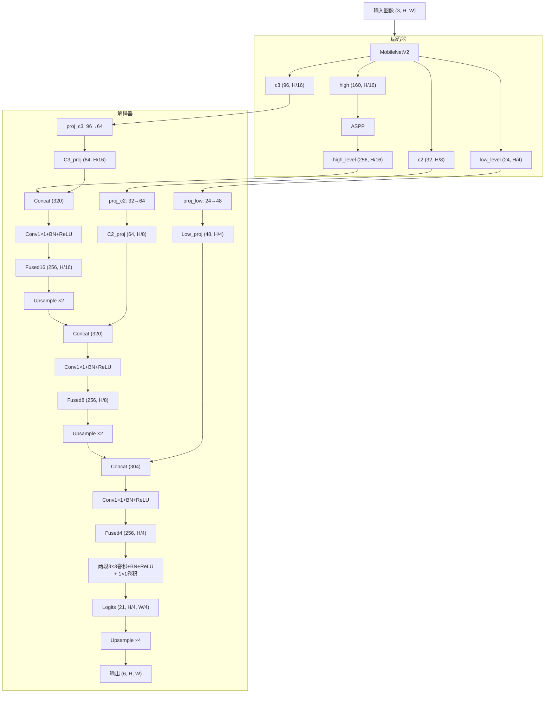
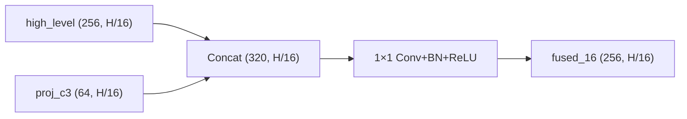
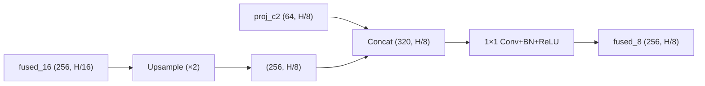
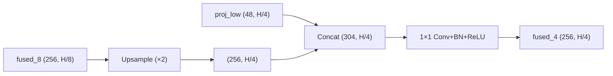
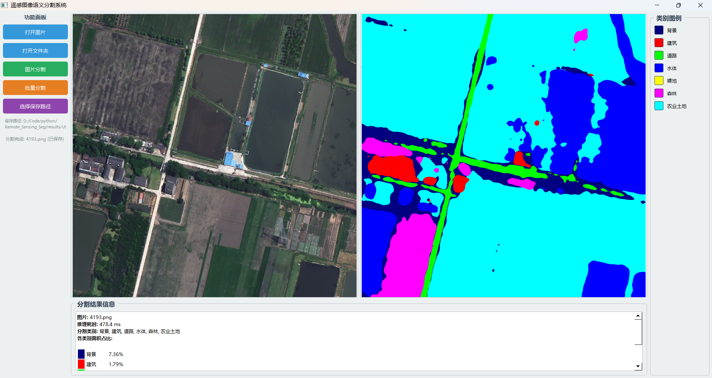

# 基于DeepLabV3+的遥感语义分割系统

## 一、项目简介

### 1.1 研究背景

遥感图像语义分割是遥感图像理解的核心任务之一，旨在对遥感图像中的每个像素进行类别标注，将其划分为建筑、道路、水体、裸地、森林、农业土地等地物类别。该技术在城市规划、土地覆盖制图、灾害评估、环境监测等领域具有重要应用价值。

然而，遥感图像具有场景复杂、尺度多变、类间差异小、类别分布不均衡等特点，传统分割方法难以满足精度需求。近年来，深度学习技术的快速发展为遥感图像语义分割提供了新的解决方案，基于全卷积网络（FCN）的语义分割方法已成为该领域的主流研究方向。

### 1.2 经典语义分割模型

#### UNet

UNet 是一种经典的编码器-解码器结构的语义分割网络。其核心思想是通过跳跃连接（Skip Connection）将编码器各层的特征图与解码器中对应分辨率的特征图进行拼接，从而在恢复空间分辨率的同时保留细节信息。UNet 结构简洁、易于训练，在医学图像和遥感图像分割中得到了广泛应用。本项目实现的 UNet 采用 4 层下采样结构，编码器通过 DoubleConv + MaxPool 逐层提取特征，解码器通过上采样 + 跳跃连接逐层恢复分辨率。

#### SegFormer

SegFormer 是一种基于 Transformer 的语义分割框架，由 Mix Transformer（MiT）编码器和轻量级 MLP 解码器组成。与传统 CNN 方法不同，SegFormer 使用重叠 Patch 嵌入（OverlapPatch）获取局部连续性，通过高效自注意力机制（EfficientSelfAttention）实现全局上下文建模，并利用 MixFFN（含深度卷积的 FFN）增强局部信息表达。本项目使用 SegFormer-b0 变体，具有 4 个 Transformer Stage（嵌入维度 \[32, 64, 160, 256]），兼顾精度与效率。

#### DeepLabV3+

DeepLabV3+ 是 Google 提出的经典语义分割模型，采用编码器-解码器架构。其核心组件包括：

- **编码器**：使用 MobileNetV2 作为骨干网络，通过空洞卷积策略（Atrous Convolution）控制输出步长（Output Stride），在保持感受野的同时提高特征图分辨率。
- **ASPP 模块**：空洞空间金字塔池化（Atrous Spatial Pyramid Pooling），使用不同扩张率（6, 12, 18）的空洞卷积并行提取多尺度上下文信息，辅以全局平均池化分支。
- **解码器**：将 ASPP 输出的高层语义特征上采样后与骨干网络低层特征（1/4 分辨率）拼接融合，通过卷积层输出最终预测。

然而，原始 DeepLabV3+ 的解码器仅融合了高层特征和单一低层特征，未充分利用骨干网络中间层的多尺度信息，导致在细小地物边界和复杂场景下的分割精度仍有提升空间。

### 1.3 本项目改进模型

针对上述问题，本项目在 DeepLabV3+ 的基础上提出改进模型 **DeepLab-MFLNet**（Multi-level Feature Fusion Network，简称 MFLNet）。该模型保持原有的 MobileNetV2 + ASPP 编码器不变，重点改进了解码器结构，引入**多级特征融合机制**，将骨干网络提取的 3 个不同尺度特征（H/4、H/8、H/16）与 ASPP 输出的高层语义特征逐级融合，从而更充分地利用多尺度信息，提升分割精度。详细的模型结构见第二部分。

***

## 二、改进模型：DeepLab-MFLNet

### 2.1 改进动机

原始 DeepLabV3+ 的解码器仅执行一次特征融合：将 ASPP 输出（H/16）上采样至 H/4 后与低层特征拼接。这种单级融合方式存在以下不足：

1. **中间层特征浪费**：MobileNetV2 编码器在 H/8 和 H/16（96 通道）分辨率处提取的中间层特征包含丰富的局部细节和语义信息，但未被解码器利用。
2. **特征融合不充分**：单次跳跃连接难以有效整合多尺度信息，尤其在遥感图像中地物尺度差异较大的场景下。

### 2.2 模型结构

MFLNet 的整体结构如下图所示，编码器保持 DeepLabV3+ 原有设计（MobileNetV2 + ASPP），解码器采用**三级逐级特征融合**策略：



### 2.3 编码器设计

编码器与原始 DeepLabV3+ 完全一致，使用 MobileNetV2（output\_stride=16）作为骨干网络。MobileNetV2 的前向过程提取 4 个尺度的特征图：

| 特征名             | 通道数 |  分辨率 | 来源          | 用途      |
| --------------- | :-: | :--: | ----------- | ------- |
| c1 (low\_level) |  24 |  H/4 | features.3  | 低层细节特征  |
| c2              |  32 |  H/8 | features.6  | 中层特征    |
| c3              |  96 | H/16 | features.13 | 高层语义特征  |
| c4 (high\_raw)  | 160 | H/16 | features.16 | ASPP 输入 |

其中 c4 经过 ASPP 模块后得到 high\_level（256 通道）。原始 DeepLabV3+ 仅使用 low\_level 和 high\_level，而 MFLNet 额外利用了 c2 和 c3。

### 2.4 解码器设计：多级特征融合

MFLNet 解码器的核心改进是**三级逐级特征融合**，具体流程如下：

#### 第一级融合（H/16 分辨率）

将 ASPP 输出的高层语义特征与骨干网络同尺度的 c3 特征融合：



- c3 经 1×1 卷积投影至 64 通道（proj\_c3: 96→64）
- 拼接后 320 通道，通过 1×1 卷积降维至 256 通道

#### 第二级融合（H/8 分辨率）

将第一级融合结果上采样后与 c2 特征融合：



- fused\_16 双线性上采样至 H/8
- c2 经 1×1 卷积投影至 64 通道（proj\_c2: 32→64）
- 拼接后 320 通道，通过 1×1 卷积降维至 256 通道

#### 第三级融合（H/4 分辨率）

将第二级融合结果上采样后与 low\_level 特征融合：



- fused\_8 双线性上采样至 H/4
- low\_level 经 1×1 卷积投影至 48 通道（proj\_low: 24→48）
- 拼接后 304 通道，通过 1×1 卷积降维至 256 通道

#### 最终预测

fused\_4 经过两层 3×3 卷积 + 1×1 卷积输出分类 logits，最后上采样 4 倍恢复至原图分辨率。

### 2.5 消融变体：C2MFLNet 与 C3MFLNet

为验证不同尺度特征对模型性能的贡献，设计了两个消融变体：

| 模型           | 融合级别             | 使用特征                               | 融合次数 |
| ------------ | ---------------- | ---------------------------------- | :--: |
| **C2MFLNet** | H/8 + H/4        | high\_level + c2 + low\_level      |   2  |
| **C3MFLNet** | H/16 + H/4       | high\_level + c3 + low\_level      |   2  |
| **MFLNet**   | H/16 + H/8 + H/4 | high\_level + c3 + c2 + low\_level |   3  |

- **C2MFLNet**：跳过 c3 特征，仅使用 c2 和 low\_level 进行两级融合，验证 c3（高层语义）的贡献。
- **C3MFLNet**：跳过 c2 特征，仅使用 c3 和 low\_level 进行两级融合，验证 c2（中层细节）的贡献。
- **MFLNet**：完整的三级融合，使用全部三个尺度的中间特征。

***

## 三、数据集与数据处理

### 3.1 LoveDA 数据集

本项目使用 **LoveDA**（Land-cover and Domain Adaptation）遥感语义分割数据集。该数据集包含来自多个城市和乡村场景的高分辨率遥感图像，涵盖 7 个地物类别，0表示忽略：

| 原始标签 |     训练标签     | 类别名称 | 英文          |
| :--: | :----------: | ---- | ----------- |
|   0  | 255 (ignore) | 忽略   | ignore      |
|   1  |       0      | 背景   | Background  |
|   2  |       1      | 建筑   | Building    |
|   3  |       2      | 道路   | Road        |
|   4  |       3      | 水体   | Water       |
|   5  |       4      | 裸地   | Barren      |
|   6  |       5      | 森林   | Forest      |
|   7  |       6      | 农业土地 | Agriculture |

数据集目录结构：

```
LoveDA/
├── Train/
│   ├── images/       # 训练图像 (952 张)
│   └── masks/        # 训练掩码
├── Val/
│   ├── images/       # 验证图像 (276 张)
│   └── masks/        # 验证掩码
└── Test/
    └── images/       # 测试图像
```

### 3.2 标签预处理

由于原始标签中类别 0（背景）代表无效区域，在训练时需要被忽略。数据加载阶段对掩码进行如下映射：

```python
mask_t = torch.where(mask_t == 0, torch.tensor(255), mask_t - 1)
```

- 原始标签 0 → 255（设为 ignore\_index，不参与损失计算）
- 原始标签 1\~6 → 0\~5（对应模型输出的 6 个类别通道）

### 3.3 数据增强

训练集使用 Albumentations 库进行丰富的数据增强：

| 增强方法                     |  概率 | 参数                                                     | 说明           |
| ------------------------ | :-: | ------------------------------------------------------ | ------------ |
| RandomResizedCrop        | 1.0 | scale=(0.5, 1.0)                                       | 随机裁剪并缩放至目标尺寸 |
| HorizontalFlip           | 0.5 | -                                                      | 水平翻转         |
| VerticalFlip             | 0.5 | -                                                      | 垂直翻转         |
| RandomRotate90           | 0.5 | -                                                      | 90°随机旋转      |
| ShiftScaleRotate         | 0.8 | shift=0.05, scale=0.1, rotate=15°                      | 平移缩放旋转       |
| ColorJitter              | 0.8 | brightness=0.3, contrast=0.3, saturation=0.3, hue=0.15 | 色彩抖动         |
| GaussianBlur             | 0.3 | blur\_limit=(3, 7)                                     | 高斯模糊         |
| RandomBrightnessContrast | 0.5 | brightness=0.2, contrast=0.2                           | 随机亮度对比度      |

验证集仅执行 Resize + Normalize，不做随机增强。所有图像使用 ImageNet 标准化参数（mean=\[0.485, 0.456, 0.406], std=\[0.229, 0.224, 0.225]）。

### 3.4 损失函数

采用**交叉熵损失 + Dice 损失**的组合损失函数：

$$
\mathcal{L} = w\_{ce} \cdot \mathcal{L}_{CE} + w_{dice} \cdot \mathcal{L}\_{Dice}
$$

其中 $w\_{ce} = 1.0$，$w\_{dice} = 0.5$。

#### 交叉熵损失（CrossEntropyLoss）

支持类别权重加权，用于缓解类别不平衡问题。类别权重根据训练集统计的各类像素频率计算：

$$
\mathrm{weight}_c = \frac{N_{\mathrm{total}}}{N\_c \times C}
$$

其中 $N\_{\mathrm{total}}$ 为有效像素总数（排除 `ignore_index=255`），$N\_c$ 为类别 $c$ 的像素数，$C$ 为类别数。忽略索引设为 255，对应原始标签 0 的背景区域。

#### Dice 损失（DiceLoss）

$$
\mathcal{L}_{Dice} = 1 - \frac{1}{K} \sum_{c=1}^{K} \frac{2 \sum\_i p\_{ic} g\_{ic} + \epsilon}{\sum\_i p\_{ic} + \sum\_i g\_{ic} + \epsilon}
$$

其中 $K$ 为目标中存在的类别数（仅对有真实像素的类别计算，避免空类别影响均值），$p\_{ic}$ 为 softmax 后的预测概率，$g\_{ic}$ 为 one‑hot 标签，$\epsilon = 10^{-6}$ 为平滑项。Dice 损失直接优化各类别的重叠度，与交叉熵互补，有助于提升小目标的分割效果。

***

### 4.1 训练策略

#### 4.1.1 优化器与学习率

- **优化器**：AdamW
- **基础学习率**：
  - 统一训练：所有参数使用相同的初始学习率 `lr = 1e-4`。
  - 分层训练（需通过 `--enable_layered_training` 显式开启）：
    - 浅层组（MobileNetV2 骨干网络）：`shallow_lr = 1e-5`
    - 深层组（解码器及其他模块）：`deep_lr = 1e-4`

#### 4.1.2 学习率调度

采用 **线性预热 + 余弦退火** 的 epoch‑级调度策略：

- **预热阶段**：前 `warmup_epochs = 10` 个 epoch，学习率从 `base_lr / warmup_epochs` 线性增长至初始学习率。
- **余弦退火阶段**：预热结束后，学习率按余弦曲线衰减至 `eta_min = 1e-6`，周期为 `epochs - warmup_epochs`。
- **调度器更新时机**：每个 epoch 结束后调用 `scheduler.step()`（即每个 epoch 更新一次），而非每个 batch。
- **分层训练时的行为**：两组参数各自从其初始学习率出发，经历完全相同的调度曲线（仅初始值不同）。

#### 4.1.3 混合精度训练

- 使用 `torch.amp.autocast` 自动混合精度，仅在 CUDA 可用时启用。
- 配合 `GradScaler` 对损失进行缩放，防止梯度下溢。
- 反向传播后执行梯度裁剪：`clip_grad_norm = 1.0`。

#### 4.1.4 早停机制

- 监控验证集的 mIoU 指标。
- 若连续 `patience = 20` 个 epoch 未获得提升，则提前终止训练，并保存当前最佳模型。

#### 4.1.5 预训练权重

- 默认 **不加载** 预训练权重。
- 可通过 `--pretrained` 标志启用自动下载或指定 `--pretrained_path` 加载自定义权重。

### 4.4 训练指令

```bash
# UNet
python -u train.py --model unet --batch_size 8 --epochs 150 --lr 1e-4 --weight_decay 1e-4 --warmup_epochs 10 --patience 20 --dice_weight 0.5 --pretrained

# SegFormer (MiT-b0)
python -u train.py --model segformer --batch_size 8 --epochs 150 --lr 1e-4 --weight_decay 1e-3 --warmup_epochs 10 --drop_rate 0.3 --patience 20 --dice_weight 0.5 --pretrained

# DeepLabV3+ (baseline)
python -u train.py --model deeplabv3plus --batch_size 8 --epochs 150 --enable_layered_training --shallow_lr 1e-4 --deep_lr 1e-3 --weight_decay 1e-4 --warmup_epochs 10 --patience 20 --dice_weight 0.5 --pretrained

# MFLNet (proposed)
python -u train.py --model mflnet --batch_size 8 --epochs 150 --enable_layered_training --shallow_lr 1e-4 --deep_lr 1e-3 --weight_decay 1e-4 --warmup_epochs 10 --patience 20 --dice_weight 0.5 --pretrained 

# C2MFLNet (ablation)
python -u train.py --model c2mflnet --batch_size 8 --epochs 150 --enable_layered_training --shallow_lr 1e-4 --deep_lr 1e-3 --weight_decay 1e-4 --warmup_epochs 10 --patience 20 --dice_weight 0.5 --pretrained 

# C3MFLNet (ablation)
python -u train.py --model c3mflnet --batch_size 8 --epochs 150 --enable_layered_training --shallow_lr 1e-4 --deep_lr 1e-3 --weight_decay 1e-4 --warmup_epochs 10 --patience 20 --dice_weight 0.5 --pretrained
```

### 4.5 训练输出

训练过程中自动保存以下文件：

| 路径                                 | 文件                    | 说明                           |
| ---------------------------------- | --------------------- | ---------------------------- |
| `checkpoints/{model}_{timestamp}/` | `best.pth`            | 验证集 mIoU 最优权重                |
| <br />                             | `last.pth`            | 最后一轮权重（含优化器状态，可断点续训）         |
| `logs/{model}_{timestamp}/`        | `result.csv`          | 每轮 Loss / mIoU / MPA / mDice |
| <br />                             | `training_curves.png` | 训练曲线可视化图                     |

***

## 五、实验结果与分析

### 5.1 评估指标

采用平均交并比（mIoU）作为主要评估指标，并报告各类别 IoU。mIoU 计算公式：

$$mIoU = \frac{1}{C} \sum\_{c=1}^{C} \frac{TP\_c}{TP\_c + FP\_c + FN\_c}$$

其中 $C$ 为类别数，$TP\_c$、$FP\_c$、$FN\_c$ 分别为类别 $c$ 的真正例、假正例和假反例像素数。

### 5.2 测试与评价流程

由于 LoveDA 测试集（Test）不公开标注掩码，实验结果通过以下流程获取：

1. **模型推理**：使用 [test.py](file:///d:/Code/python/Remote_Sensing_Seg/test.py) 对 LoveDA Test 集图像进行预测，生成单通道预测掩码并保存至 `RESULT_PATH` 指定目录。
2. **结果打包**：将预测结果目录打包为 `Result.zip`。
3. **在线评测**：将 `Result.zip` 上传至 LoveDA 官方指定的 Codabench 评测平台，由平台后端基于真实标注计算 mIoU 及各类别 IoU。

> 评测网站：<https://www.codabench.org/competitions/13030/>

### 5.3 消融实验

为验证多级特征融合中不同尺度特征的贡献，对比 MFLNet 及其两个消融变体（C2MFLNet、C3MFLNet）在 LoveDA 测试集上的表现：

| 模型                    | 融合特征                     | 融合层级数 |  mIoU (%) |
| --------------------- | ------------------------ | :---: | :-------: |
| DeepLabV3+ (Baseline) | high + low               |   1   |   47.54   |
| C2MFLNet              | high + c2 + low          |   2   |   48.53   |
| C3MFLNet              | high + c3 + low          |   2   |   49.07   |
| **MFLNet**            | **high + c3 + c2 + low** | **3** | **50.77** |

**各类别 IoU 详细对比：**

| 类别          | DeepLabV3+ (Baseline) (%) | C2MFLNet (%) | C3MFLNet (%) | MFLNet (%) |
| ----------- | :-----------------------: | :----------: | :----------: | :--------: |
| Background  |           30.03           |     35.19    |     34.54    |  **36.43** |
| Building    |         **54.85**         |     55.52    |     54.61    |    55.03   |
| Road        |           47.57           |     50.69    |     52.90    |  **54.38** |
| Water       |           74.25           |     73.35    |   **76.80**  |    76.08   |
| Barren      |           20.07           |     18.23    |     20.08    |  **29.10** |
| Forest      |           44.48           |   **44.91**  |     44.48    |    43.90   |
| Agriculture |           61.55           |   **61.84**  |     60.05    |    60.50   |

**分析**：

1. **MFLNet（三级融合）取得最优 mIoU（50.77%）**，相比 Baseline（DeepLabV3+）提升 3.23 个百分点，相比 C2MFLNet 提升 2.24%，相比 C3MFLNet 提升 1.70%，验证了完整多级特征融合的有效性。
2. **C3MFLNet 优于 C2MFLNet**（49.07% vs 48.53%），表明同尺度的高层语义特征 c3 比 c2 更为关键，第一级融合（H/16）对整体性能贡献更大。
3. MFLNet 在 Background（+6.40%）、Road（+6.81%）和 Barren（+9.03%）类别上提升显著，说明多尺度融合有助于改善困难类别的分割精度。
4. 四种模型均完整利用了 high\_level 和 low\_level，差异仅在于是否引入 c2/c3 中间层特征，结果证明同时引入两者的三级融合策略最优。

### 5.4 对比实验

将 MFLNet 与三种经典语义分割模型（UNet、SegFormer、DeepLabV3+）进行对比：

| 模型                |  mIoU (%) |
| ----------------- | :-------: |
| UNet              |   41.12   |
| SegFormer-b0      |   46.71   |
| DeepLabV3+        |   47.54   |
| **MFLNet (Ours)** | **50.77** |

各类别 IoU 详细对比：

| 类别          | UNet (%) | SegFormer (%) | DeepLabV3+ (%) | MFLNet (%) |
| ----------- | :------: | :-----------: | :------------: | :--------: |
| Background  |   27.48  |     31.00     |      30.03     |  **36.43** |
| Building    |   46.73  |     50.71     |    **54.85**   |    55.03   |
| Road        |   43.12  |     50.31     |      47.57     |  **54.38** |
| Water       |   71.81  |     71.28     |      74.25     |  **76.08** |
| Barren      |   14.54  |     14.95     |      20.07     |  **29.10** |
| Forest      |   37.81  |   **45.67**   |      44.48     |    43.90   |
| Agriculture |   46.39  |   **63.03**   |      61.55     |    60.50   |

**分析**：

1. **MFLNet 取得最优 mIoU（50.77%）**，相比基线 DeepLabV3+ 提升 3.23%，相比 UNet 提升 9.65%，相比 SegFormer 提升 4.06%，验证了多级特征融合改进的有效性。
2. UNet 表现最差（41.12%），主要由于其纯 CNN 编码器-解码器结构缺乏多尺度上下文建模能力，在 Background（27.48%）和 Barren（14.54%）等困难类别上表现不足。
3. SegFormer 在 Forest（45.67%）和 Agriculture（63.03%）上表现较好，受益于 Transformer 的全局上下文建模能力，但在 Barren（14.95%）上表现较差。
4. MFLNet 相比 DeepLabV3+ 在所有主要类别上均有提升，尤其在 Barren（+9.03%）、Background（+6.40%）和 Road（+6.81%）上提升显著，说明多级特征融合有效弥补了原始解码器特征利用不充分的缺陷。

### 5.5 模型复杂度与推理速度

为综合评价各模型的资源开销，使用 [test_size.py](file:///d:/Code/python/Remote_Sensing_Seg/test_size.py) 统计参数量、FLOPs 与推理速度，结果如下表：

| 模型                | Params (M) | MACs (G) | FLOPs (G) | Latency (ms) | FPS    |
| ----------------- | :--------: | :------: | :-------: | :----------: | :----: |
| UNet              |   31.038   | 219.052  |  438.103  |    43.61     | 22.93  |
| SegFormer-b0      |    3.716   |   6.785  |   13.571  |     9.32     | 107.27 |
| DeepLabV3+        |    4.151   |  24.790  |   49.580  |     7.99     | 125.12 |
| **MFLNet (Ours)** |  **4.292** | **24.711** | **49.422** | **8.36**   | **119.59** |

**统计口径：**

- 输入尺寸为 3×512×512、batch size = 1，类别数 7。
- Params 为模型全部可学习参数；MACs 由 thop 统计，FLOPs = 2 × MACs。
- Latency 与 FPS 在 CUDA 上实测：模型设为 eval 模式并关闭梯度计算，先预热 50 次（触发 cuDNN 算子选择与显存分配），再连续推理 200 次取平均，计时前后均执行 `torch.cuda.synchronize()` 保证计时完整。

**分析：**

1. **UNet 最为笨重**：参数量（31.04M）和 FLOPs（438.10G）均为四个模型中最高，推理速度也最慢（22.93 FPS），结合其最低的 mIoU（41.12%），精度与效率均不占优。
2. **SegFormer 最为轻量**：参数量仅 3.72M、FLOPs 仅 13.57G，FPS 达 107.27，资源开销最低，但其 mIoU（46.71%）低于 DeepLabV3+ 与 MFLNet。
3. **MFLNet 以极小的开销换来显著精度提升**：相比基线 DeepLabV3+，参数量仅增加 0.14M（4.29M vs 4.15M，+3.4%），FLOPs 基本持平（49.42G vs 49.58G），FPS 仅从 125.12 略降至 119.59（-4.4%），而 mIoU 提升了 3.23 个百分点（50.77% vs 47.54%），充分说明多级特征融合改进具有很高的性价比。

***

## 六、模型部署与前端设计

### 6.1 ONNX 模型导出

训练完成后，使用 export\_onnx.py 将 PyTorch 模型（.pth）导出为 ONNX 格式，便于跨平台部署：

```python
# export_onnx.py 顶部配置
MODEL_NAME      = 'mflnet'
CHECKPOINT_PATH = './checkpoints/mflnet_20260810_170418/best.pth'
OUTPUT_PATH     = './checkpoints/mflnet_20260810_170418/best.onnx'
NUM_CLASSES     = 7
SAMPLE_SIZE     = 1024
OPSET_VERSION   = 13
USE_SIMPLIFY    = True
```

导出特性：

- 支持**动态尺寸**（batch / height / width 均可变）
- 使用 onnx-simplifier 优化计算图
- 兼容 ONNX Runtime 的 CPU 和 GPU 推理

### 6.2 前端系统设计

基于 PyQt5 开发图形化用户界面（[UI.py](file:///d:/Code/python/Remote_Sensing_Seg/UI.py)），采用 ONNX Runtime 后端推理，无需完整 PyTorch 环境即可运行。

#### 系统界面展示



#### 后端推理流程


#### 功能特性

| 功能         | 说明                     |
| ---------- | ---------------------- |
| 单张推理       | 选择单张遥感图像，实时分割预测并显示彩色掩码 |
| 批量分割       | 选择文件夹，后台线程逐张推理，进度条显示进度 |
| 彩色可视化      | 预测掩码按类别颜色映射为 RGB 彩色图   |
| 类别统计       | 统计各类别像素数与面积占比（%）       |
| 结果保存       | 支持保存单通道掩码和彩色分割结果       |
| GPU/CPU自适应 | 自动检测 CUDA，优先使用 GPU 推理  |
| 多线程        | 推理在 QThread 中执行，避免界面卡顿 |

***

## 七、未来工作

1. **注意力机制引入**：在多级特征融合模块中引入通道注意力（CBAM）或坐标注意力（CoordAtt），增强特征融合的有效性。
2. **边缘细化模块**：针对遥感图像中地物边界模糊的问题，设计边缘检测辅助分支，提升边界分割精度。
3. **多尺度训练与测试**：引入多尺度训练策略和多尺度测试时增强（TTA），进一步提升模型对不同尺度地物的适应性。
4. **跨域泛化**：在 LoveDA 的 Urban 和 Rural 两个域上进行域适应研究，提升模型在跨域场景下的泛化能力。
5. **轻量化部署**：探索模型剪枝、量化等轻量化技术，进一步降低推理延迟，满足实时应用需求。
6. **更大规模数据集**：在更大规模的遥感数据集（如 iSAID、OpenCities）上验证模型的有效性和泛化能力。

***

## 八、参考文献

1. Wang J, Zheng Z, Ma A, et al. LoveDA: A remote sensing land-cover dataset for domain adaptive semantic segmentation\[J]. arXiv preprint arXiv:2110.08733, 2021.
2. Ronneberger O, Fischer P, Brox T. U-net: Convolutional networks for biomedical image segmentation\[C]//International Conference on Medical image computing and computer-assisted intervention. Cham: Springer international publishing, 2015: 234-241.
3. Chen L C, Papandreou G, Kokkinos I, et al. Deeplab: Semantic image segmentation with deep convolutional nets, atrous convolution, and fully connected crfs\[J]. IEEE transactions on pattern analysis and machine intelligence, 2017, 40(4): 834-848.
4. Chen L C, Zhu Y, Papandreou G, et al. Encoder-decoder with atrous separable convolution for semantic image segmentation\[C]//European conference on computer vision. Cham: Springer International Publishing, 2018: 833-851.
5. Xie E, Wang W, Yu Z, et al. SegFormer: Simple and efficient design for semantic segmentation with transformers\[J]. Advances in neural information processing systems, 2021, 34: 12077-12090.
6. Sandler M, Howard A, Zhu M, et al. Mobilenetv2: Inverted residuals and linear bottlenecks\[C]//2018 IEEE/CVF conference on computer vision and pattern recognition. Ieee, 2018: 4510-4520.

***

## 九、许可证与致谢

**本项目代码采用** **[GPL-3.0](file:///d:/Code/python/Remote_Sensing_Seg/LICENSE)** **开源许可**，仅供学习与研究使用。选择 GPL-3.0 是为与 PyQt5（GUI 依赖）及 [milesial/Pytorch-UNet](https://github.com/milesial/Pytorch-UNet)（UNet 代码与权重来源，同为 GPL-3.0）保持许可兼容。

⚠️ **非商业使用限制**：以下两部分**不得用于商业目的**，不随项目 GPL-3.0 许可解除：

- **SegFormer 代码与 MiT-b0 权重**：源自 [NVlabs/SegFormer](https://github.com/NVlabs/SegFormer)，受 NVIDIA Source Code License 第 3.3 条约束（仅限非商业研究/评估）。
- **LoveDA 数据集**：遵循 [CC BY-NC-SA 4.0](https://creativecommons.org/licenses/by-nc-sa/4.0/)，数据集不随仓库分发，请至 [官方仓库](https://github.com/Junjue-Wang/LoveDA) 下载。

**第三方来源致谢：**

| 模块                       | 来源                                                                                            | 许可                  |
| :----------------------- | :-------------------------------------------------------------------------------------------- | :------------------ |
| MobileNetV2 结构与权重        | [pytorch/vision](https://github.com/pytorch/vision)                                           | BSD-3-Clause        |
| SegFormer / MiT-b0 结构与权重 | [NVlabs/SegFormer](https://github.com/NVlabs/SegFormer)                                       | NVIDIA License（非商业） |
| DeepLabV3+ / ASPP 思想     | [Google Research](https://github.com/tensorflow/models/tree/master/research/deeplab)（本项目自主实现） | Apache-2.0          |
| UNet 结构与 Carvana 权重      | [milesial/Pytorch-UNet](https://github.com/milesial/Pytorch-UNet)                             | GPL-3.0             |

> 所有预训练权重（`*.pth`/`*.onnx`）不随仓库分发，运行时自动从官方下载。

**引用（Citation）：** 本项目使用 LoveDA 数据集，如对你有帮助请引用原论文：

```bibtex
@inproceedings{wang2021loveda,
  title={Love{DA}: A Remote Sensing Land-Cover Dataset for Domain Adaptive Semantic Segmentation},
  author={Wang, Junjue and Zheng, Zhuo and Ma, Ailong and Wang, Qiming and Zhong, Yanfei},
  booktitle={NeurIPS Datasets and Benchmarks Track},
  year={2021}
}
```

> 本项目以学术交流为目的发布，使用风险自负。如涉版权问题请通过 GitHub Issue 联系。欢迎 ⭐ Star。

